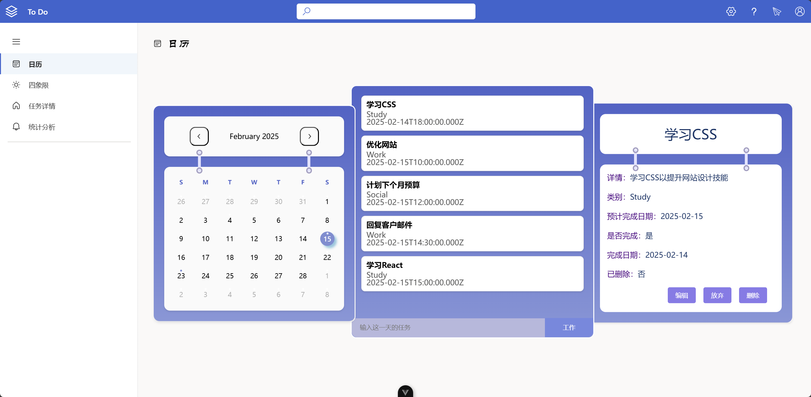
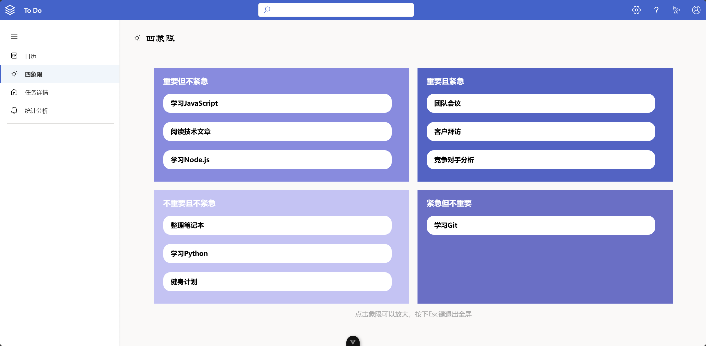
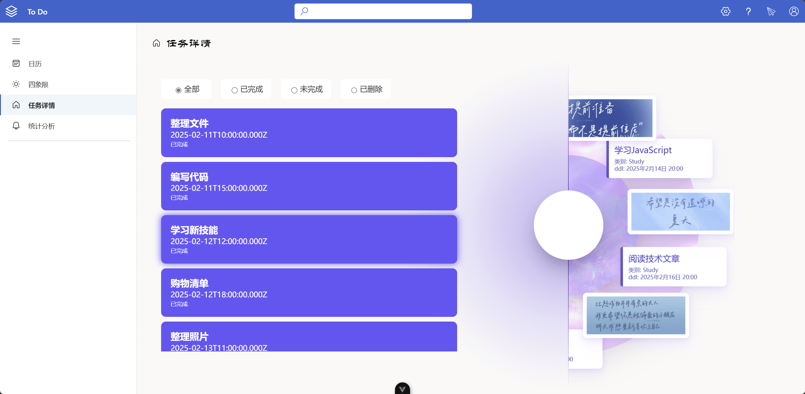
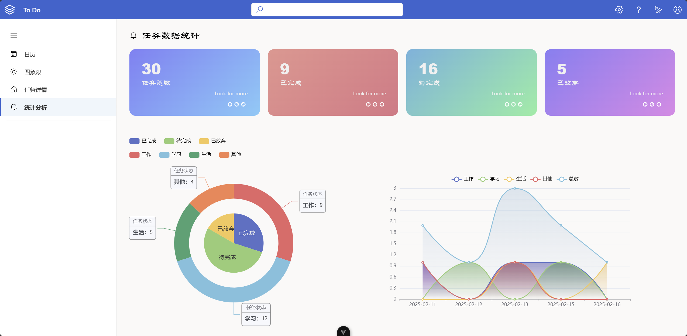
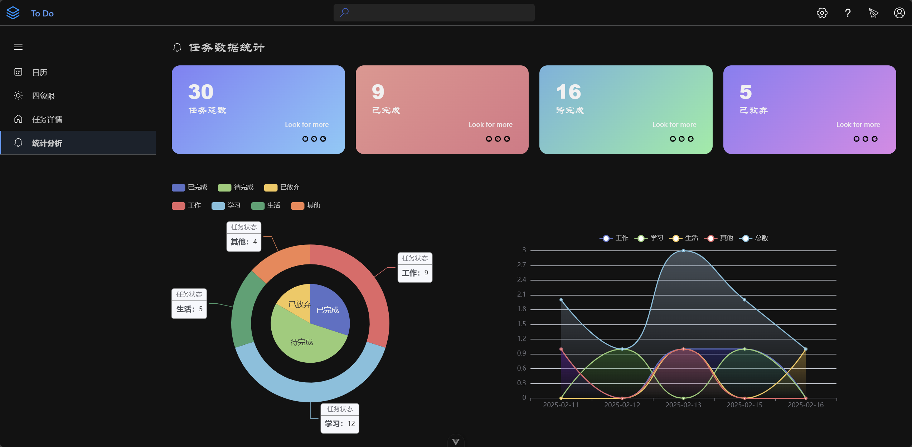
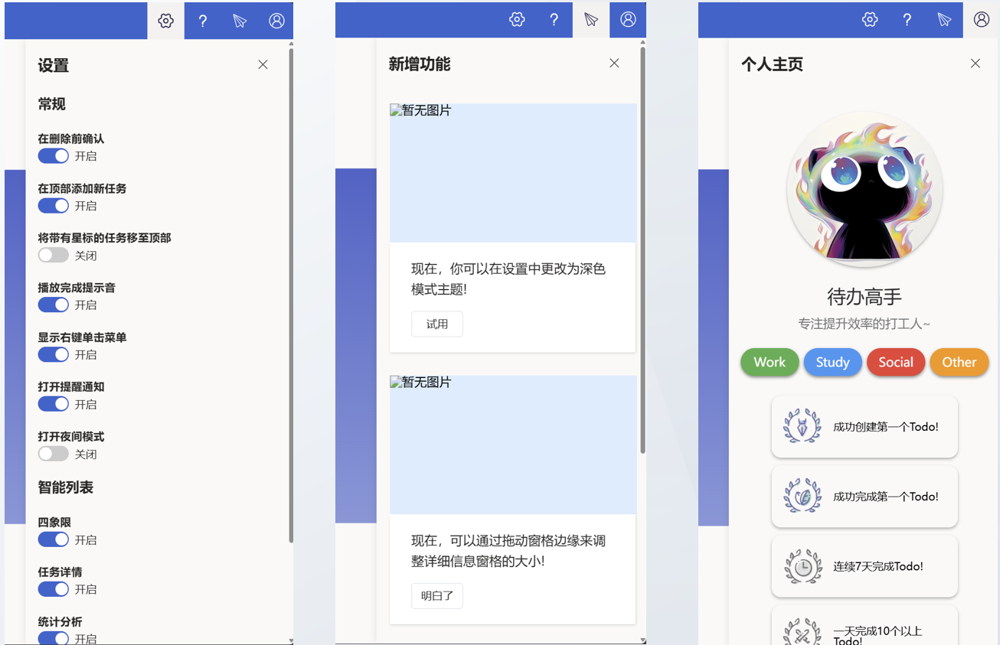

# ToDo

🏗 Owner-pro Project

🚀 一个简单的待办事项（To-Do List）应用，支持任务管理、状态更新、数据存储，并提供清晰的用户界面。

## 🌟 主要功能

✅ 添加任务  
✅ 删除任务  
✅ 编辑任务  
✅ 放弃任务  
✅ 标记任务完成/未完成/删除  
✅ 任务重要/紧急的分类  
✅ 任务过滤（全部/已完成/未完成）    
✅ 任务统计分析（各类占比与每日任务完成情况）  
✅ 后端数据库支持    

---

## 🛠 技术栈
- **前端**：Vue 3 + Pinia（状态管理）
- **后端**：Spring Boot + Maven（后端框架）
- **数据库**：Mysql（数据库）

---

## 📦 安装 & 运行

### 1️⃣ 克隆项目
```bash
git clone https://github.com/Taslr2/ToDo.git
cd web
```

### 2️⃣ 安装依赖
```bash
npm install
```

### 3️⃣ 运行前端
```bash
npm run dev
```
前端默认运行在 `http://localhost:5173`

### 4️⃣ 运行后端
```bash
cd server/Todo/src/main/java/Todo_Test/TestTodoApplication.java
```
后端默认运行在 `http://localhost:8080`

---

## 🎮 使用方法
1. **添加任务**：切换到日历界面，点击对应日期，输入任务内容与分类，点击 `ENTER` 
2. **编辑任务**：点击任务，点击下方 `编辑` 按钮，编辑任务内容与分类等内容
3. **删除任务**：点击任务下方的 `删除` 按钮
4. **标记完成**：在 `编辑` 页面，勾选任务复选框，并选择完成时间，标记任务完成
5. **切换筛选**：选择 `全部` / `已完成` / `未完成` 进行筛选
6. **任务查询**：在搜索框中输入任务关键词，进行任务搜索
7. **双色模式**：在 `设置` 中 `关闭` / `打开` 深色模式
8. **更多功能**：等你来发现~

---

## 🖥 界面截图

### 日历界面


### 四象限界面


### 任务详情界面


### 统计分析界面


### 深色模式


### 右侧侧边栏
包含了 `设置`、`新增功能`、`个人主页` 等功能  


---

## 📌 目录结构
```plaintext
Todo/
│   ├── README_img/
├── server/
│   ├── .idea/
│   ├── Todo/
│   │   ├── .idea/
│   │   ├── src/
│   │   │   ├── main/
│   │   │   │   ├── java/
│   │   │   │   ├── resources/
│   │   │   ├── target/
│   ├── pom.xml
│   ├── .gitkeep
├── web/
│   ├── .vscode/
│   ├── node_modules/
│   ├── public/
│   ├── src/
│   │   ├── api/
│   │   ├── assets/
│   │   ├── components/
│   │   |   ├── avatar/
│   │   |   ├── head/
│   │   |   ├── loading/
│   │   |   ├── RightPopUpWindow/
│   │   |   ├── sidebar/
│   │   |   ├── TaskItemModal.vue
│   │   ├── router/
│   │   ├── store/
│   │   ├── utils/
│   │   ├── views/
|   |   |   ├── account/
|   |   |   ├── main/
|   |   |   |   ├── CalendarView/
|   |   |   |   ├── FourQuadrant/
|   |   |   |   ├── StatisticalAnalysis/
|   |   |   |   ├── TaskDetails/
|   |   |   ├── priority/
│   │   ├── App.vue
│   │   ├── main.js
│   ├── .editorconfig
│   ├── .gitignore
│   ├── .prettierrc.json
│   ├── auto-imports.d.ts
│   ├── components.d.ts
│   ├── eslint.config.js
│   ├── index.html
│   ├── jsconfig.json
│   ├── package-lock.json
│   ├── package.json
│   ├── pnpm-lock.yaml
│   ├── README.md
│   ├── vite.config.js
│   ├── vitest.config.js
├── .gitignore
├── README.md
```

---

📌 未来改进
- 1️⃣ 添加用户登录注册功能
- 2️⃣ 用户个人信息修改
- 3️⃣ 任务截止日期提醒
- 4️⃣ 任务优先级排序
- 5️⃣ 任务导入导出
- 6️⃣ 等待探索……
